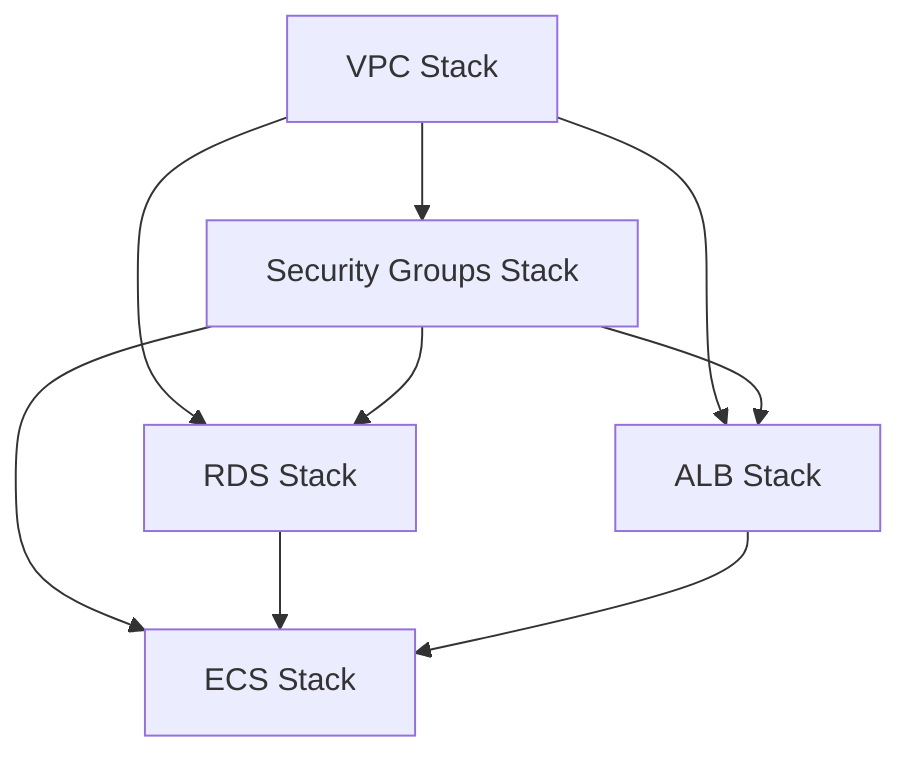

# Cloud Optimizer - CloudFormation Architecture

## Architecture Diagram

```
┌─────────────────────────────────────────────────────────────────┐
│                           Internet                               │
└────────────────────────────┬────────────────────────────────────┘
                             │
                    ┌────────▼────────┐
                    │ Internet Gateway │
                    └────────┬────────┘
                             │
        ┌────────────────────┴────────────────────┐
        │                                          │
┌───────▼────────┐                        ┌───────▼────────┐
│ Public Subnet  │                        │ Public Subnet  │
│  10.0.1.0/24   │                        │  10.0.2.0/24   │
│                │                        │                │
│ ┌────────────┐ │                        │ ┌────────────┐ │
│ │    ALB     │ │◄───────────────────────┼─►     ALB     │ │
│ └────────────┘ │                        │ └────────────┘ │
│                │                        │                │
│ ┌────────────┐ │                        │                │
│ │NAT Gateway │ │                        │                │
│ └──────┬─────┘ │                        │                │
└────────┼────────┘                        └────────────────┘
         │  AZ-a                              AZ-b
         │
    ┌────┴────────────────────────────────┐
    │                                     │
┌───▼──────────┐                    ┌────▼─────────┐
│Private Subnet│                    │Private Subnet│
│ 10.0.3.0/24  │                    │ 10.0.4.0/24  │
│              │                    │              │
│ ┌──────────┐ │                    │ ┌──────────┐ │
│ │ECS Task  │ │◄───────────────────┼─►ECS Task  │ │
│ │Container │ │                    │ │Container │ │
│ └────┬─────┘ │                    │ └────┬─────┘ │
│      │       │                    │      │       │
│      │       │                    │      │       │
│      │   ┌───▼────────────────────▼──┐   │       │
│      │   │   RDS PostgreSQL DB       │   │       │
│      │   │   (Multi-AZ Optional)     │   │       │
│      │   └───────────────────────────┘   │       │
│      │                                    │       │
└──────┼────────────────────────────────────┼───────┘
       │                                    │
       └────────────────┬───────────────────┘
                        │
                ┌───────▼────────┐
                │ CloudWatch Logs │
                │ /ecs/cloud-opt  │
                └─────────────────┘
```

## Network Flow

### Inbound Request Flow

1. **User** → Internet → ALB (Port 80/443)
2. **ALB** → ECS Tasks (Port 8000) via private subnets
3. **ECS Tasks** → RDS PostgreSQL (Port 5432) within private network

### Outbound Request Flow

1. **ECS Tasks** → NAT Gateway → Internet Gateway → Internet
   - Used for: Pulling Docker images, external API calls, etc.

## Component Details

### VPC (10.0.0.0/16)

| Component | CIDR | Purpose | Internet Access |
|-----------|------|---------|-----------------|
| Public Subnet 1 | 10.0.1.0/24 | ALB, NAT Gateway | Yes (IGW) |
| Public Subnet 2 | 10.0.2.0/24 | ALB | Yes (IGW) |
| Private Subnet 1 | 10.0.3.0/24 | ECS Tasks, RDS | Via NAT |
| Private Subnet 2 | 10.0.4.0/24 | ECS Tasks, RDS | Via NAT |

### Security Groups

```
┌─────────────────────────────────────────────────────────────┐
│ ALB Security Group                                          │
│ Inbound:                                                    │
│   - Port 80 from 0.0.0.0/0                                  │
│   - Port 443 from 0.0.0.0/0                                 │
└───────────────────────┬─────────────────────────────────────┘
                        │
                        │ Port 8000
                        ▼
┌─────────────────────────────────────────────────────────────┐
│ ECS Security Group                                          │
│ Inbound:                                                    │
│   - Port 8000 from ALB SG only                              │
│ Outbound:                                                   │
│   - All traffic to 0.0.0.0/0                                │
└───────────────────────┬─────────────────────────────────────┘
                        │
                        │ Port 5432
                        ▼
┌─────────────────────────────────────────────────────────────┐
│ RDS Security Group                                          │
│ Inbound:                                                    │
│   - Port 5432 from ECS SG only                              │
└─────────────────────────────────────────────────────────────┘
```

### IAM Roles

#### Task Execution Role
- **Purpose**: Allows ECS to pull images and write logs
- **Managed Policy**: AmazonECSTaskExecutionRolePolicy
- **Permissions**:
  - ECR: Pull container images
  - CloudWatch Logs: Create log streams, put events

#### Task Role
- **Purpose**: Grants permissions to the application
- **Permissions**:
  - EC2: Describe operations (for scanning)
  - IAM: Get/List operations (for security analysis)
  - CloudWatch: Get/List operations (for metrics)
  - Logs: Create/write log streams

## Resource Dependencies



### Deployment Order

1. **VPC Stack** (2-3 min)
   - VPC, Subnets, Internet Gateway, NAT Gateway, Route Tables

2. **Security Groups Stack** (1 min)
   - ALB SG, ECS SG, RDS SG

3. **RDS Stack** (5-6 min) - Longest step
   - DB Subnet Group, RDS PostgreSQL Instance

4. **ALB Stack** (2 min)
   - Application Load Balancer, Target Group, HTTP Listener

5. **ECS Stack** (1-2 min)
   - ECS Cluster, Task Definition, Service, IAM Roles

**Total Time**: 8-10 minutes

## High Availability Features

### Enabled by Default

- **Multi-AZ Subnets**: Resources spread across 2 availability zones
- **ALB**: Automatically load balances across multiple targets
- **ECS Service**: Can scale to multiple tasks across AZs
- **RDS Backups**: Automated daily backups with 7-day retention

### Optional (Production)

- **RDS Multi-AZ**: Set `MultiAZ=true` for automatic failover
- **ECS Auto Scaling**: Add Application Auto Scaling policies
- **Multiple NAT Gateways**: One per AZ for redundancy
- **ALB HTTPS**: Add ACM certificate for SSL/TLS

## Monitoring & Logging

### CloudWatch Logs

- **Log Group**: `/ecs/cloud-optimizer`
- **Retention**: 7 days
- **Contents**:
  - Application logs (stdout/stderr)
  - Container startup/shutdown events
  - Error messages

### CloudWatch Metrics (Available)

- **ECS Service**: CPU, Memory, Task count
- **ALB**: Request count, Target response time, HTTP errors
- **RDS**: CPU, Storage, Connections, IOPS
- **NAT Gateway**: Bytes in/out, Connection count

### Recommended Alarms

```yaml
ECS:
  - TargetGroupHealthyHostCount < 1
  - ServiceCPUUtilization > 80%
  - ServiceMemoryUtilization > 80%

RDS:
  - CPUUtilization > 80%
  - DatabaseConnections > 80% of max
  - FreeStorageSpace < 2GB

ALB:
  - UnHealthyHostCount > 0
  - TargetResponseTime > 1s
  - HTTPCode_Target_5XX_Count > 10
```

## Cost Breakdown

### Fixed Monthly Costs

| Resource | Configuration | Monthly Cost |
|----------|--------------|--------------|
| NAT Gateway | 1 gateway | $32.40 |
| NAT Data Processing | 10GB/month | $4.50 |
| ALB | 1 load balancer | $16.20 |
| ALB LCUs | Minimal traffic | $2.00 |

**Fixed Total**: ~$55/month

### Variable Costs (Trial Config)

| Resource | Configuration | Monthly Cost |
|----------|--------------|--------------|
| RDS | db.t3.micro, 20GB | $14.60 |
| ECS Fargate | 0.25 vCPU, 0.5GB | $12.24 |
| CloudWatch Logs | 1GB/month | $0.50 |
| Data Transfer | 10GB out | $0.90 |

**Variable Total**: ~$28/month

**Grand Total**: ~$83/month

### Cost Optimization

1. **Stop after hours**: Schedule ECS service to 0 tasks during non-business hours
2. **Use Fargate Spot**: Save up to 70% on ECS costs
3. **RDS Reserved Instance**: 40% savings with 1-year commitment
4. **Single AZ for dev**: Disable Multi-AZ in development environments

## Security Best Practices

### Network Security

- [x] Private subnets for application and database
- [x] Security groups with least privilege access
- [x] No direct internet access for ECS tasks (via NAT only)
- [x] RDS not publicly accessible
- [ ] VPC Flow Logs (optional, adds cost)
- [ ] AWS WAF on ALB (optional, adds cost)

### Data Security

- [x] RDS encryption at rest enabled
- [x] Automated backups with 7-day retention
- [x] Deletion protection via DeletionPolicy: Snapshot
- [ ] Secrets Manager for credentials (recommended upgrade)
- [ ] KMS customer-managed keys (optional)

### Access Security

- [x] IAM roles with least privilege
- [x] No hardcoded credentials in task definition
- [x] CloudWatch Logs for audit trail
- [ ] AWS Systems Manager Session Manager (optional)
- [ ] CloudTrail for API logging (optional)

## Scaling Strategies

### Horizontal Scaling (More Tasks)

```bash
# Scale to 3 tasks
aws cloudformation update-stack \
  --stack-name cloud-optimizer \
  --use-previous-template \
  --parameters ParameterKey=DesiredCount,ParameterValue=3 \
  --capabilities CAPABILITY_NAMED_IAM
```

### Vertical Scaling (Bigger Tasks)

```bash
# Scale to 0.5 vCPU, 1GB RAM
aws cloudformation update-stack \
  --stack-name cloud-optimizer \
  --use-previous-template \
  --parameters \
    ParameterKey=ContainerCpu,ParameterValue=512 \
    ParameterKey=ContainerMemory,ParameterValue=1024 \
  --capabilities CAPABILITY_NAMED_IAM
```

### Auto Scaling (Production)

Add Application Auto Scaling target and policies:

```yaml
ECSAutoScalingTarget:
  Type: AWS::ApplicationAutoScaling::ScalableTarget
  Properties:
    MinCapacity: 1
    MaxCapacity: 10
    ResourceId: !Sub service/${ECSCluster}/${ECSService.Name}
    ScalableDimension: ecs:service:DesiredCount
    ServiceNamespace: ecs

ECSScalingPolicy:
  Type: AWS::ApplicationAutoScaling::ScalingPolicy
  Properties:
    PolicyType: TargetTrackingScaling
    TargetTrackingScalingPolicyConfiguration:
      TargetValue: 75.0
      PredefinedMetricSpecification:
        PredefinedMetricType: ECSServiceAverageCPUUtilization
```

## Disaster Recovery

### Backup Strategy

- **RDS Automated Backups**: Daily, 7-day retention
- **RDS Snapshots**: Manual snapshots before major changes
- **CloudFormation Templates**: Version controlled in Git

### Recovery Procedures

#### Recover from RDS Failure

```bash
# List available snapshots
aws rds describe-db-snapshots \
  --db-instance-identifier cloud-optimizer-db

# Restore from snapshot
aws cloudformation update-stack \
  --stack-name cloud-optimizer \
  --parameters ParameterKey=DBSnapshotIdentifier,ParameterValue=<snapshot-id>
```

#### Recover from Region Failure

1. Deploy stack in different region
2. Restore RDS from cross-region snapshot
3. Update DNS to point to new region's ALB

## Template Customization

### Common Modifications

1. **Change Database Engine**:
   - Update `Engine` and `EngineVersion` in rds.yaml
   - Adjust port in security groups

2. **Add HTTPS Support**:
   - Create ACM certificate
   - Add HTTPS listener to ALB
   - Redirect HTTP to HTTPS

3. **Add Auto Scaling**:
   - Add `AWS::ApplicationAutoScaling::ScalableTarget`
   - Add `AWS::ApplicationAutoScaling::ScalingPolicy`

4. **Add Caching Layer**:
   - Add ElastiCache subnet group
   - Add Redis/Memcached cluster
   - Update ECS security group

5. **Add S3 for Assets**:
   - Create S3 bucket
   - Add bucket policy for CloudFront
   - Update task role with S3 permissions

## References

- [AWS CloudFormation Documentation](https://docs.aws.amazon.com/cloudformation/)
- [AWS ECS Best Practices](https://docs.aws.amazon.com/AmazonECS/latest/bestpracticesguide/)
- [AWS RDS PostgreSQL](https://docs.aws.amazon.com/AmazonRDS/latest/UserGuide/CHAP_PostgreSQL.html)
- [AWS Well-Architected Framework](https://aws.amazon.com/architecture/well-architected/)
