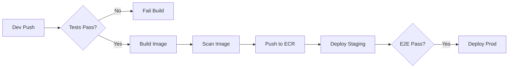

# Deployment Guide

**Version:** 2.0.0
**Last Updated:** 2025-12-01
**MVP Alignment:** PHASED_IMPLEMENTATION_PLAN.md v2.0

---

## 1. Deployment Philosophy

Cloud Optimizer v2 is deployed as an **AWS Marketplace Container Product** with a trial-first strategy. The system follows GitOps-driven deployment with all infrastructure defined in code.

### Key Principles
- **Bundled Container:** Cloud Optimizer (CO) and Intelligence-Builder (IB) ship as a single Docker image
- **AWS Marketplace Native:** License validation, usage metering via Marketplace APIs
- **One-Click Deploy:** CloudFormation template for trial customers
- **Immutable Infrastructure:** Containers built once, promoted through environments
- **Blue/Green Deployment:** Zero-downtime deployments for production

---

## 2. Container Architecture

Cloud Optimizer and Intelligence-Builder are **bundled into a single Docker image** for simplified deployment and version synchronization.

### Architecture Overview

```
┌─────────────────────────────────────────────────────────────────┐
│                 cloud-optimizer:v2.0.0-ib1.0.0                   │
│  ┌─────────────────────────────────────────────────────────────┐│
│  │                    Single Process                            ││
│  │  ┌─────────────────┐  ┌─────────────────────────────────┐  ││
│  │  │  CO API Server  │  │  IB Platform (embedded library)  │  ││
│  │  │  - FastAPI      │  │  - Graph Backend                 │  ││
│  │  │  - Chat API     │──│  - Pattern Engine                │  ││
│  │  │  - Scanners     │  │  - NLU Pipeline                  │  ││
│  │  │  - Doc Upload   │  │  - Answer Generation             │  ││
│  │  └─────────────────┘  └─────────────────────────────────┘  ││
│  └─────────────────────────────────────────────────────────────┘│
│                              │                                   │
│                    Exposes port 8000                             │
└──────────────────────────────┼───────────────────────────────────┘
                               │
              ┌────────────────┼────────────────┐
              ▼                ▼                ▼
        ┌──────────┐    ┌──────────┐    ┌──────────────┐
        │PostgreSQL│    │  Redis   │    │AWS Marketplace│
        │  (RDS)   │    │(Optional)│    │  Metering API │
        └──────────┘    └──────────┘    └──────────────┘
```

### Versioning Strategy

```
Image Tag: cloud-optimizer:v{CO_VERSION}-ib{IB_VERSION}
Example:   cloud-optimizer:v2.0.0-ib1.0.0
```

### Deployment Patterns

| Environment | Pattern | Description |
|-------------|---------|-------------|
| **Trial (MVP)** | **Single Container + RDS** | CloudFormation deploys one ECS task + RDS |
| **Production** | **ECS Fargate** | Auto-scaling task group behind ALB |
| **Local Dev** | **Docker Compose** | Container + local PostgreSQL + LocalStack |
| **K8s (Future)** | **Helm Chart** | Single pod deployment with ConfigMaps |

### Docker Compose (Local Development)

```yaml
version: "3.8"
services:
  cloud-optimizer:
    build:
      context: .
      dockerfile: docker/Dockerfile
    image: cloud-optimizer:dev
    ports:
      - "8000:8000"
    environment:
      - DATABASE_URL=postgresql://postgres:postgres@db:5432/cloud_optimizer
      - REDIS_URL=redis://redis:6379
      - AWS_ENDPOINT_URL=http://localstack:4566  # For local testing
      - MARKETPLACE_ENABLED=false  # Disable for local dev
    depends_on:
      - db
      - redis

  db:
    image: postgres:15
    environment:
      POSTGRES_DB: cloud_optimizer
      POSTGRES_PASSWORD: postgres
    volumes:
      - postgres_data:/var/lib/postgresql/data
    ports:
      - "5432:5432"

  redis:
    image: redis:7-alpine
    ports:
      - "6379:6379"

  localstack:
    image: localstack/localstack:latest
    environment:
      - SERVICES=s3,secretsmanager,sts
    ports:
      - "4566:4566"

volumes:
  postgres_data:
```

### Dockerfile (Multi-Stage Build)

```dockerfile
# Stage 1: Build
FROM python:3.11-slim as builder

WORKDIR /app
COPY pyproject.toml poetry.lock ./
RUN pip install poetry && poetry export -f requirements.txt > requirements.txt

COPY src/ ./src/
RUN pip wheel --no-cache-dir --wheel-dir /wheels -r requirements.txt

# Stage 2: Runtime
FROM python:3.11-slim as runtime

# Security: non-root user
RUN useradd -m -u 1000 appuser

WORKDIR /app
COPY --from=builder /wheels /wheels
RUN pip install --no-cache-dir /wheels/*

COPY src/ ./src/
COPY alembic/ ./alembic/
COPY alembic.ini ./

# Compliance KB data (baked into image)
COPY data/compliance/ ./data/compliance/

USER appuser
EXPOSE 8000

# Health check
HEALTHCHECK --interval=30s --timeout=10s --start-period=60s \
  CMD curl -f http://localhost:8000/health || exit 1

# Entrypoint handles migrations + startup
ENTRYPOINT ["python", "-m", "cloud_optimizer.entrypoint"]
```

---

## 3. CI/CD Pipeline

We use GitHub Actions for our CI/CD pipeline.

### Stages

| Stage | Trigger | Actions |
|-------|---------|---------|
| **Build & Test** | PR Open / Push | 1. Lint & Format (Ruff/Black)<br>2. Unit Tests (Pytest)<br>3. Build Docker Image<br>4. Image Scan (Trivy) |
| **Integration** | Merge to `main` | 1. Deploy to Staging (Ephemerally)<br>2. Run Integration Tests<br>3. Push Image to ECR (tag: `sha-xxxx`) |
| **Staging** | Manual / Tag | 1. Deploy to Staging Environment<br>2. Run E2E Tests |
| **Production** | Release Tag | 1. Deploy to Production (Blue/Green)<br>2. Post-deployment Health Check |

### Pipeline Diagram



---

## 4. Infrastructure as Code (IaC)

We use **Terraform** to manage our AWS infrastructure.

### Directory Structure
```
terraform/
├── modules/
│   ├── vpc/
│   ├── ecs/
│   ├── rds/
│   └── redis/
├── environments/
│   ├── staging/
│   │   └── main.tf
│   └── prod/
│       └── main.tf
└── backend.tf
```

### State Management
- **Backend:** S3 Bucket (`co-terraform-state`)
- **Locking:** DynamoDB Table (`co-terraform-lock`)

---

## 5. Production Environment

### Architecture
- **VPC:** Multi-AZ (3 AZs) with Public/Private subnets.
- **Compute:** ECS Fargate in Private Subnets.
- **Load Balancer:** Application Load Balancer (ALB) in Public Subnets.
- **Database:** RDS PostgreSQL (Multi-AZ) in Private Subnets.
- **Cache:** ElastiCache Redis (Multi-AZ) in Private Subnets.

### Security Groups
- **ALB:** Allow 443 from 0.0.0.0/0 (restricted by WAF).
- **ECS:** Allow traffic only from ALB SG.
- **RDS/Redis:** Allow traffic only from ECS SG.

### Chat/Streaming Configuration

The Security Q&A chat requires Server-Sent Events (SSE) support:

```yaml
# ALB Configuration for Chat
ALB:
  idle_timeout: 300  # 5 minutes for long chat sessions

  # Target Group for streaming endpoint
  TargetGroup:
    protocol: HTTP
    health_check:
      path: /health
      interval: 30
      timeout: 10
    stickiness:
      enabled: true  # Required for streaming
      duration: 3600

# ECS Task Definition
TaskDefinition:
  containerDefinitions:
    - name: cloud-optimizer
      portMappings:
        - containerPort: 8000
          protocol: tcp
      environment:
        - name: STREAMING_ENABLED
          value: "true"
        - name: CHAT_TIMEOUT_SECONDS
          value: "300"
```

### Secrets Management
All secrets (DB passwords, API keys) are stored in **AWS Secrets Manager** and injected into containers at runtime as environment variables.

---

## 6. Rollback Strategy

### Automated Rollback
If the health check fails within 5 minutes of a new deployment:
1. ECS stops routing traffic to the new task set.
2. ECS reverts to the previous task definition.
3. Alert is sent to the `#ops-alerts` channel.

### Manual Rollback
Run the `rollback` workflow in GitHub Actions:
```bash
gh workflow run rollback.yml --ref v2.1.0
```

---

## 7. Observability Setup

Observability is phased to match MVP scope:

| Phase | Scope | Components |
|-------|-------|------------|
| **MVP (Phase 1-2)** | Minimal | Health checks + CloudWatch Logs |
| **Phase 4+** | Full | Metrics + Tracing + Dashboards |

### MVP Observability (Minimal)

```yaml
# Health Endpoint
GET /health
Response: { "status": "healthy", "components": { "db": "ok", "ib": "ok" } }

# CloudWatch Logs (JSON format)
{
  "timestamp": "2025-12-01T10:00:00Z",
  "level": "INFO",
  "message": "Chat response generated",
  "duration_ms": 2100,
  "user_id": "xxx",
  "intent": "security_assessment"
}
```

### Full Observability (Phase 4+)

#### Logging
- **Application Logs:** JSON format via structlog → CloudWatch Logs
- **Access Logs:** ALB logs → S3 (90-day retention)
- **Audit Logs:** Security events → RDS + S3 archive

#### Metrics (CloudWatch)
- `cloud_optimizer_chat_response_seconds` - Chat latency histogram
- `cloud_optimizer_document_analysis_seconds` - Doc processing time
- `cloud_optimizer_scan_duration_seconds` - AWS scan duration
- `cloud_optimizer_active_trials` - Trial customer count

#### Tracing (AWS X-Ray)
- Enabled via OpenTelemetry SDK
- Traces: Chat → NLU → Search → Answer Generation

#### Dashboards
- `CO-Prod-Overview` - Request rate, latency, errors
- `CO-Chat-Performance` - Chat-specific metrics
- `CO-Trial-Funnel` - Trial → conversion metrics

### Alerts (MVP)

| Alert | Condition | Severity |
|-------|-----------|----------|
| **Chat Slow** | p95 > 3s for 5 minutes | Warning |
| **API Errors** | 5xx > 1% for 5 minutes | Critical |
| **Health Check Fail** | /health returns non-200 | Critical |
| **Database CPU** | > 80% for 15 minutes | Warning |

---

## 8. AWS Marketplace Container Deployment

Cloud Optimizer is distributed as an **AWS Marketplace Container Product** with integrated license validation and usage metering.

### Marketplace Product Configuration

```yaml
Product:
  Type: Container
  DeliveryMethod: AWS Marketplace Container
  PricingModel: Usage-Based

  Dimensions:
    - Name: SecurityScans
      Description: Number of AWS account scans
      Unit: Scans
    - Name: ChatQuestions
      Description: Security Q&A questions asked
      Unit: Questions
    - Name: DocumentAnalysis
      Description: Architecture documents analyzed
      Unit: Documents

  Trial:
    Duration: 14 days
    Limits:
      SecurityScans: 50
      ChatQuestions: 500
      DocumentAnalysis: 20
```

### CloudFormation Quick-Start Template

Trial customers deploy via one-click CloudFormation:

```yaml
AWSTemplateFormatVersion: '2010-09-09'
Description: Cloud Optimizer - Security Advisor (Trial)

Parameters:
  InstanceType:
    Type: String
    Default: t3.medium
    AllowedValues: [t3.small, t3.medium, t3.large]

  DatabaseInstanceClass:
    Type: String
    Default: db.t3.small

Resources:
  # VPC with public/private subnets
  VPC:
    Type: AWS::EC2::VPC
    Properties:
      CidrBlock: 10.0.0.0/16
      EnableDnsHostnames: true

  # RDS PostgreSQL
  Database:
    Type: AWS::RDS::DBInstance
    Properties:
      DBInstanceClass: !Ref DatabaseInstanceClass
      Engine: postgres
      EngineVersion: "15"
      AllocatedStorage: 20
      MasterUsername: cloudoptimizer
      MasterUserPassword: !Sub '{{resolve:secretsmanager:${DBSecret}:SecretString:password}}'
      VPCSecurityGroups:
        - !Ref DBSecurityGroup

  # ECS Cluster
  ECSCluster:
    Type: AWS::ECS::Cluster
    Properties:
      ClusterName: cloud-optimizer-trial

  # ECS Service with Marketplace container
  ECSService:
    Type: AWS::ECS::Service
    Properties:
      Cluster: !Ref ECSCluster
      TaskDefinition: !Ref TaskDefinition
      DesiredCount: 1
      LaunchType: FARGATE

  # Task Definition
  TaskDefinition:
    Type: AWS::ECS::TaskDefinition
    Properties:
      Family: cloud-optimizer
      Cpu: 1024
      Memory: 2048
      NetworkMode: awsvpc
      RequiresCompatibilities: [FARGATE]
      ContainerDefinitions:
        - Name: cloud-optimizer
          Image: !Sub "${AWS::AccountId}.dkr.ecr.${AWS::Region}.amazonaws.com/cloud-optimizer:latest"
          PortMappings:
            - ContainerPort: 8000
          Environment:
            - Name: DATABASE_URL
              Value: !Sub "postgresql://cloudoptimizer:password@${Database.Endpoint.Address}:5432/cloudoptimizer"
            - Name: MARKETPLACE_PRODUCT_CODE
              Value: !Ref MarketplaceProductCode
            - Name: TRIAL_MODE
              Value: "true"

Outputs:
  ApplicationURL:
    Description: Cloud Optimizer URL
    Value: !Sub "https://${ALB.DNSName}"

  SetupTime:
    Description: Estimated setup time
    Value: "8-10 minutes"
```

### License Validation Flow

```python
# Startup license validation
async def validate_marketplace_license():
    """Called on container startup."""
    try:
        response = await marketplace_client.register_usage(
            ProductCode=os.environ["MARKETPLACE_PRODUCT_CODE"],
            PublicKeyVersion=1,
        )
        logger.info("License valid", customer_id=response["CustomerIdentifier"])
        return LicenseStatus.VALID

    except CustomerNotEntitledException:
        logger.info("No license - starting trial mode")
        return LicenseStatus.TRIAL

    except CustomerNotSubscribedException:
        logger.warning("Subscription expired")
        return LicenseStatus.EXPIRED
```

### Usage Metering

```python
# Meter usage after each billable action
async def meter_usage(dimension: str, quantity: int = 1):
    """Report usage to AWS Marketplace."""
    if not settings.MARKETPLACE_ENABLED:
        return

    await marketplace_client.meter_usage(
        ProductCode=settings.MARKETPLACE_PRODUCT_CODE,
        Timestamp=datetime.utcnow(),
        UsageDimension=dimension,  # "SecurityScans", "ChatQuestions", etc.
        UsageQuantity=quantity,
    )
```

---

## 9. Knowledge Base Management

The Compliance Knowledge Base (HIPAA, SOC2, PCI-DSS, GDPR, CIS) is critical for the Expert System.

### KB Deployment Strategy

| Approach | Description | Used For |
|----------|-------------|----------|
| **Baked into Image** | Compliance data in `/data/compliance/` | MVP - static data |
| **Init Container** | Download latest KB on startup | Production - fresh data |
| **Scheduled Update** | Daily job to refresh CVE/security bulletins | Continuous updates |

### Data Structure

```
data/compliance/
├── hipaa/
│   ├── controls.json        # 45 HIPAA controls
│   ├── aws_mapping.json     # AWS service → HIPAA control mapping
│   └── remediation.json     # Remediation guidance
├── soc2/
│   ├── trust_services.json  # 64 SOC2 criteria
│   └── aws_mapping.json
├── pci_dss/
│   ├── requirements.json    # 250+ PCI-DSS requirements
│   └── aws_mapping.json
├── gdpr/
│   ├── articles.json        # 99 GDPR articles
│   └── aws_mapping.json
├── cis_aws/
│   ├── benchmark_v2.json    # 200+ CIS controls
│   └── remediation.json
└── aws/
    ├── security_best_practices.json
    └── well_architected_security.json
```

### KB Sizing

| Framework | Entities | Relationships | Storage |
|-----------|----------|---------------|---------|
| HIPAA | ~500 | ~1,200 | 2 MB |
| SOC 2 | ~400 | ~900 | 1.5 MB |
| PCI-DSS | ~1,500 | ~3,000 | 5 MB |
| GDPR | ~600 | ~1,400 | 2 MB |
| CIS AWS | ~2,000 | ~5,000 | 8 MB |
| AWS Best Practices | ~500 | ~1,000 | 2 MB |
| **Total** | **~5,500** | **~12,500** | **~20 MB** |

### Update Schedule

| Data Source | Update Frequency | Method |
|-------------|------------------|--------|
| CIS Benchmarks | Monthly | New image release |
| CVE/NVD | Daily | Scheduled job |
| AWS Security Bulletins | Real-time (webhook) | Event-driven |
| AWS Pricing | Weekly | Scheduled job |

### KB Init Job

```yaml
# Kubernetes Job for KB initialization
apiVersion: batch/v1
kind: Job
metadata:
  name: kb-init
spec:
  template:
    spec:
      containers:
        - name: kb-loader
          image: cloud-optimizer:latest
          command: ["python", "-m", "cloud_optimizer.jobs.load_kb"]
          env:
            - name: DATABASE_URL
              valueFrom:
                secretKeyRef:
                  name: db-credentials
                  key: url
      restartPolicy: OnFailure
```

---

## 10. Version History

| Version | Date | Changes |
|---------|------|---------|
| 2.0.0 | 2025-12-01 | Major update: Bundled container architecture, AWS Marketplace deployment, KB management, chat/streaming support, MVP-aligned observability |
| 1.0.0 | 2025-12-01 | Initial deployment guide |
